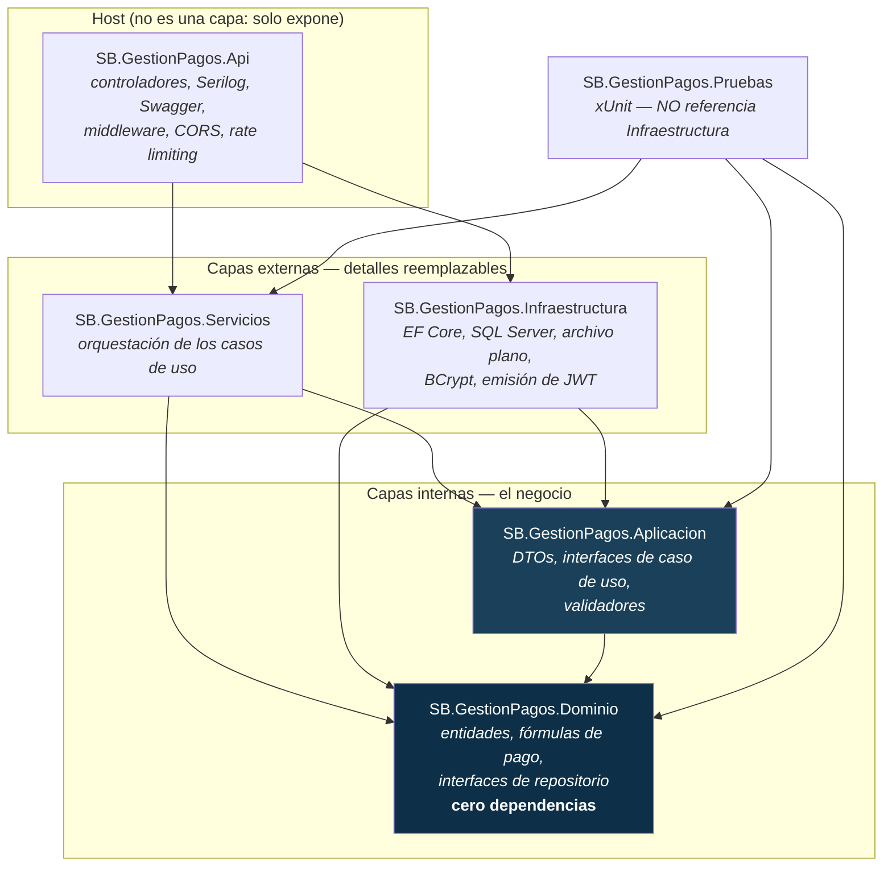

# SB.GestionPagos — Sistema de Gestión de Pagos de Empleados

Prueba técnica para la posición de Desarrollador Full Stack de la **Superintendencia de
Bancos de la República Dominicana**.

Aplicación web que calcula los pagos semanales de los empleados de una compañía según su
tipo de contrato, administra su información, genera el reporte de nómina y controla el
acceso por roles. Incluye además el mantenimiento del listado de entidades gubernamentales
de la República Dominicana, persistido en archivo de texto plano tal como exige el documento
de arquitectura.

---

## Tabla de contenido

1. [Alcance](#1-alcance)
2. [Stack y versiones](#2-stack-y-versiones)
3. [Arquitectura](#3-arquitectura)
4. [Puesta en marcha](#4-puesta-en-marcha)
5. [Credenciales y matriz de permisos](#5-credenciales-y-matriz-de-permisos)
6. [Endpoints](#6-endpoints)
7. [Pruebas](#7-pruebas)
8. [Supuestos y decisiones de diseño](#8-supuestos-y-decisiones-de-diseño)
9. [Cumplimiento de las especificaciones técnicas](#9-cumplimiento-de-las-especificaciones-técnicas)
10. [Cumplimiento de los criterios de evaluación](#10-cumplimiento-de-los-criterios-de-evaluación)
11. [Lo que quedó fuera y por qué](#11-lo-que-quedó-fuera-y-por-qué)

---

## 1. Alcance

| Módulo | Qué hace | Almacén |
|---|---|---|
| **Empleados** | Alta, consulta con filtros, edición y baja lógica de los cuatro tipos de contrato | SQL Server |
| **Cálculo de pago** | Las cuatro fórmulas de la p. 5 del enunciado, con desglose por concepto | — (Dominio) |
| **Reportes** | Nómina semanal con el detalle del cálculo de cada empleado | SQL Server |
| **Entidades gubernamentales** | CRUD del listado de 181 entidades de la RD, con búsqueda | Archivo de texto plano |
| **Autenticación** | Inicio de sesión con JWT y dos roles | SQL Server |

Todo el CRUD se opera **desde la interfaz web**, no solo desde Swagger.

### Los cuatro tipos de empleado

| Tipo | Fórmula del pago semanal |
|---|---|
| Empleado Asalariado | `salarioSemanal` |
| Empleado por Horas | `horas ≤ 40` → `sueldoPorHora × horas`<br>`horas > 40` → `(sueldoPorHora × 40) + (sueldoPorHora × 1.5 × (horas − 40))` |
| Empleado por Comisión | `ventasBrutas × tarifaComision` |
| Empleado Asalariado por Comisión | `(ventasBrutas × tarifaComision) + salarioBase + (salarioBase × 0.10)` |

---

## 2. Stack y versiones

### Backend

| Componente | Versión | Dónde |
|---|---|---|
| .NET SDK | 8.0.130 (fijado en `global.json`) | Toda la solución |
| ASP.NET Core Web API | 8.0 | `SB.GestionPagos.Api` |
| Entity Framework Core + SQL Server | 8.0 | `SB.GestionPagos.Infraestructura` |
| Serilog (consola + archivo rotativo) | 8.0 | `SB.GestionPagos.Api` |
| Swashbuckle (Swagger) | 6.6 | `SB.GestionPagos.Api` |
| FluentValidation | 11 | `SB.GestionPagos.Aplicacion` |
| BCrypt.Net-Next | 4.0 | `SB.GestionPagos.Infraestructura` |
| xUnit + FluentAssertions + NSubstitute | — | `SB.GestionPagos.Pruebas` |

### Frontend

| Componente | Versión |
|---|---|
| React | 18.3 |
| TypeScript (modo `strict`) | 5.9 |
| Vite | 8.2 |
| react-router-dom | 6.30 |
| axios | 1.20 |
| react-hook-form + zod | 7.87 / 4.5 |

Sin librerías de componentes (MUI, Ant, Chakra): la maqueta se replica con **CSS Modules
propios**, porque el criterio de maquetación es parte de lo que se evalúa.

### Base de datos

- **SQL Server 2022** en contenedor Docker, para empleados y usuarios.
- **Archivo de texto plano** (`entidades-gubernamentales.txt`, formato JSONL) dentro del
  proyecto, para el catálogo de entidades gubernamentales.

---

## 3. Arquitectura

**Onion Architecture** de cuatro capas, con los nombres que exige el documento de
arquitectura: `[SB].[NombreProyecto].[Capa]`.



**Toda flecha apunta hacia adentro.** El `SB.GestionPagos.Dominio.csproj` no tiene ni una
sola `<ProjectReference>` ni `<PackageReference>`: es la garantía, verificada por el
compilador, de que la lógica de negocio no puede depender de EF Core, ASP.NET, JSON ni de la
existencia de una base de datos. Si ese archivo deja de estar vacío, la Onion se rompió.

### Qué va en cada capa

| Capa | Contenido | Regla mecánica para no equivocarse |
|---|---|---|
| **Dominio** | `Empleado` abstracto + 4 subclases, `CalcularDesglosePagoSemanal()`, constantes de las fórmulas, `EntidadGubernamental`, `Usuario`, enums, excepciones e **interfaces de repositorio** | Si no compilaría sin quitar un `using`, no va aquí |
| **Aplicación** | DTOs, `IEmpleadoServicio`, `IReporteServicio`, validadores de FluentValidation, `Resultado<T>` | Si el tipo dice `interface` o termina en `Dto` / `Validador` |
| **Servicios** | Las implementaciones. Orquesta: busca, comprueba, deja calcular al Dominio, mapea | Si tiene un constructor con dependencias inyectadas |
| **Infraestructura** | `GestionPagosDbContext`, mapeos TPH, migraciones, repositorios SQL y de archivo, BCrypt, JWT | Si nombra una tecnología concreta |
| **Api** (host) | Controladores delgados, registro de dependencias, canal HTTP | Cero lógica de negocio |

> **Aplicación es el guion; Servicios son los actores.** El documento de SB enumera ambas
> capas pero no las define; esta es la lectura adoptada, y está justificada en `PLAN.md §4.3`.

### El flujo de una petición

```
Navegador ──HTTP──> [ Api ]
                      │  1. MiddlewareManejoExcepciones  (red de seguridad, va primero)
                      │  2. MiddlewareCorrelacion        (X-Id-Correlacion)
                      │  3. UseSerilogRequestLogging     (una línea por petición)
                      │  4. CORS → RateLimiter → Authentication → Authorization
                      │  5. FiltroValidacion             (FluentValidation, filtro global)
                      ▼
                   Controlador ──IEmpleadoServicio──> [ Servicios ]
                                                          │
                                          IEmpleadoRepositorio (interfaz del Dominio)
                                                          ▼
                                                   [ Infraestructura ] ──> SQL Server
                                                          │
                                       empleado.CalcularDesglosePagoSemanal()
                                                          ▼
                                                     [ Dominio ]
```

El controlador no calcula, el servicio no calcula, el repositorio no calcula. **La fórmula
del pago nunca sale del Dominio.**

---

## 4. Puesta en marcha

### 4.1 Requisitos previos

| Herramienta | Versión mínima | Comprobar con |
|---|---|---|
| .NET SDK | 8.0.130 | `dotnet --version` |
| Node.js | 20.19 (Vite 8 no arranca por debajo) | `node -v` |
| Docker | cualquiera reciente | `docker --version` |

> Si prefiere no usar Docker, basta cualquier instancia de SQL Server accesible: solo cambia
> la cadena de conexión del paso 4.3.

### 4.2 Levantar SQL Server

```bash
docker run -d --name sql-sb \
  -e 'ACCEPT_EULA=Y' \
  -e 'MSSQL_SA_PASSWORD=SbPrueba2026!' \
  -p 1433:1433 \
  mcr.microsoft.com/mssql/server:2022-latest
```

Si el contenedor ya existe de una ejecución anterior: `docker start sql-sb`.

> Asigne al menos **2 GB de memoria** a Docker. SQL Server se detiene con
> `Exited (137)` —falta de memoria— y el síntoma no lo dice.

### 4.3 Configurar los secretos

El `appsettings.json` versionado **no contiene la contraseña ni la clave de firma reales**:
lleva marcadores. La configuración real vive en `appsettings.Development.json`, que está en
`.gitignore` y hay que crear:

```bash
cat > src/SB.GestionPagos.Api/appsettings.Development.json <<'JSON'
{
  "ConnectionStrings": {
    "SbGestionPagos": "Server=localhost,1433;Database=SbGestionPagos;User Id=sa;Password=SbPrueba2026!;TrustServerCertificate=True;"
  },
  "Jwt": {
    "Emisor": "SB.GestionPagos.Api",
    "Audiencia": "SB.GestionPagos.Frontend",
    "ClaveDeFirma": "sb-gestion-pagos-clave-de-desarrollo-8f4c1d9b6a2e7350cf1a4d8e6b3927fa",
    "MinutosDeVigencia": 60
  },
  "Registro": { "Directorio": "Registros" },
  "Cors": { "OrigenesPermitidos": [ "http://localhost:5173" ] }
}
JSON
```

**La aplicación se niega a arrancar si falta cualquiera de los dos valores o si la clave de
firma sigue con el marcador.** Es deliberado: una API que levanta bien y firma tokens con
una clave publicada en el repositorio es peor que una que no levanta.

### 4.4 Crear la base de datos

Cualquiera de los dos caminos produce el mismo resultado. **No son dos fuentes de verdad
distintas**: el `.sql` está generado desde la migración con
`dotnet ef migrations script --idempotent`.

**Opción A — migraciones de EF Core** (recomendada si tiene el SDK):

```bash
dotnet tool install --global dotnet-ef   # solo la primera vez
dotnet ef database update \
  --project src/SB.GestionPagos.Infraestructura \
  --startup-project src/SB.GestionPagos.Api
```

**Opción B — script SQL** (`db/script-inicial.sql`, el entregable que pide la p. 8):

```bash
docker cp db/script-inicial.sql sql-sb:/tmp/
docker exec sql-sb /opt/mssql-tools18/bin/sqlcmd \
  -S localhost -U sa -P 'SbPrueba2026!' -C -i /tmp/script-inicial.sql
```

El script **crea la base si no existe** y es **idempotente**: cada bloque comprueba
`__EFMigrationsHistory` antes de actuar, así que ejecutarlo dos veces no duplica nada ni
falla. Crea las dos tablas, los cinco índices y siembra **2 usuarios y 16 empleados**
(cuatro de cada tipo de contrato).

### 4.5 Levantar el backend

```bash
dotnet run --project src/SB.GestionPagos.Api --launch-profile http
```

- API: `http://localhost:5122`
- **Swagger: `http://localhost:5122/swagger`** — con botón *Authorize* para el token Bearer
- Sonda de salud: `http://localhost:5122/salud`
- Registros: `src/SB.GestionPagos.Api/Registros/sb-gestion-pagos-<fecha>.log`

> Use el perfil **`http`**. El perfil `https` usa un certificado autofirmado que obliga a
> `dotnet dev-certs https --trust` antes de que el navegador acepte las llamadas del frontend.

### 4.6 Levantar el frontend

```bash
cd frontend
npm install
npm run dev
```

Queda en `http://localhost:5173`. **El puerto es fijo a propósito** (`strictPort` en
`vite.config.ts`): la política de CORS del backend autoriza ese origen y solo ese, así que si
Vite se moviera a otro puerto el navegador bloquearía todas las respuestas, y el error de
consola no menciona el puerto.

Si la API no está en el puerto por omisión, cree `frontend/.env.development` a partir de
`.env.example` y ajuste `VITE_URL_BASE_API`.

---

## 5. Credenciales y matriz de permisos

Los siembra la migración inicial (y el script SQL). Las contraseñas se guardan como hash
**BCrypt con factor de trabajo 12**; nunca en claro.

| Usuario | Contraseña | Rol |
|---|---|---|
| `admin` | `Admin123!` | Administrador |
| `usuario` | `Usuario123!` | Usuario |

El enunciado pide "permisos básicos (admin/usuario)" sin decir qué puede cada uno. Matriz
adoptada:

| Operación | Administrador | Usuario |
|---|:---:|:---:|
| Consultar empleados y ver el detalle | ✅ | ✅ |
| Crear / editar / dar de baja empleados | ✅ | ❌ 403 |
| Consultar entidades gubernamentales | ✅ | ✅ |
| Crear / editar / eliminar entidades | ✅ | ❌ 403 |
| Generar el reporte de nómina semanal | ✅ | ✅ |

En el frontend, las acciones de escritura no se dibujan para el rol `Usuario`.
**Ocultarlas es cortesía, no seguridad**: quien escriba la URL a mano llega igual, y ahí el
que dice que no es el 403 del servidor.

---

## 6. Endpoints

| Método | Ruta | Política | Qué hace |
|---|---|---|---|
| `POST` | `/api/autenticacion/inicio-sesion` | **anónimo** | Devuelve el token. Único endpoint público |
| `GET` | `/api/autenticacion/sesion` | Lectura | Identidad del portador del token |
| `GET` | `/api/empleados` | Lectura | Página de empleados. Filtros: `nombre`, `departamento`, `estado`, `pagina`, `tamanoPagina` |
| `GET` | `/api/empleados/{id}` | Lectura | Un empleado con su pago calculado |
| `DELETE` | `/api/empleados/{id}` | Administrador | Baja **lógica** (204) |
| `POST` `PUT` | `/api/empleados/asalariados` | Administrador | Alta y edición |
| `POST` `PUT` | `/api/empleados/por-horas` | Administrador | Alta y edición |
| `POST` `PUT` | `/api/empleados/por-comision` | Administrador | Alta y edición |
| `POST` `PUT` | `/api/empleados/asalariados-por-comision` | Administrador | Alta y edición |
| `GET` | `/api/entidades-gubernamentales` | Lectura | Catálogo con filtros `nombre` y `sector` |
| `GET` `POST` `PUT` `DELETE` | `/api/entidades-gubernamentales[/{id}]` | Administrador para escritura | CRUD del catálogo |
| `GET` | `/api/reportes/nomina-semanal` | Lectura | Reporte con desglose. Filtros: `departamento`, `incluirInactivos` |
| `GET` | `/salud` | anónimo | Sonda de vida |

**Hay un controlador por tipo de empleado y ninguno repite código**: los cuatro heredan de
`ControladorEmpleadosPorTipo<TCreacion, TActualizacion>`, que aporta las dos acciones. Cada
tipo cuesta un archivo de doce líneas.

### Contrato de errores

**Todas** las respuestas de error del sistema —las de un controlador, las del filtro de
validación, las del middleware de excepciones y las del rechazo por límite de frecuencia—
son `ProblemDetails` (RFC 7807) y llevan el identificador de correlación:

```json
{
  "type": "https://tools.ietf.org/html/rfc9110#section-15.5.1",
  "title": "La solicitud contiene errores de validación",
  "status": 400,
  "instance": "/api/empleados/por-horas",
  "errors": {
    "SueldoPorHora": ["El campo 'Sueldo Por Hora' no puede ser negativo."],
    "HorasTrabajadas": ["El campo 'Horas Trabajadas' debe estar entre 0 y 168."]
  },
  "idCorrelacion": "8d81e211c7b0404d88c96a25ec2fac44"
}
```

Ese `idCorrelacion` es el **mismo valor** que viaja en la cabecera `X-Id-Correlacion` de la
respuesta y el que prefija cada línea del archivo de registro. El usuario reporta un
identificador que existe en el log.

---

## 7. Pruebas

```bash
dotnet test
```

**98 pruebas, todas en verde.** El enunciado pide un mínimo de 2–3.

| Archivo | Qué cubre |
|---|---|
| `Dominio/CalculoPagoSemanalPruebas.cs` | Las cuatro fórmulas y el despacho polimórfico desde la clase base |
| `Dominio/HorasExtraPruebas.cs` | La frontera de las 40 horas: 39,9 / 40 / 40,5 / 41. Es el error clásico de esta fórmula |
| `Dominio/InvariantesDelDominioPruebas.cs` | Rechazo de importes negativos, horas fuera de rango, textos vacíos |
| `Dominio/AtomicidadDeLaEdicionPruebas.cs` | Que un dato inválido no deje la entidad medio actualizada |
| `Servicios/EmpleadoPorHorasServicioPruebas.cs` | Alta, edición, duplicados, tipo de contrato equivocado |
| `Servicios/EmpleadoServicioBusquedaPruebas.cs` | Que el filtro llegue **intacto** al repositorio y que el servicio no re-filtre en memoria |
| `Servicios/EmpleadoServicioBajaPruebas.cs` | Baja lógica e idempotencia del doble clic |

El proyecto de pruebas **no referencia `SB.GestionPagos.Infraestructura`**, y es una decisión,
no un olvido: si pudiera ver EF Core, tarde o temprano alguien escribiría un test que necesita
el contenedor de SQL Server encendido para pasar. Los repositorios se simulan con NSubstitute.

### Frontend

```bash
cd frontend
npm run lint    # ESLint — 0 problemas
npm run build   # tsc en modo strict + build de producción
```

---

## 8. Supuestos y decisiones de diseño

### 8.1 Inconsistencias detectadas en el enunciado y cómo se resolvieron

| # | Qué dice el documento | Cómo se resolvió |
|---|---|---|
| 1 | La captura de **Empleado por Horas** (p. 4) omite `primerNombre`, pero los otros tres tipos sí lo listan | Omisión de redacción. `PrimerNombre` vive en la clase base `Empleado` y aplica a los cuatro tipos |
| 2 | La lista de la p. 4 nombra el cuarto tipo como *"por comisión y empleado por comisión"* — repite el tercero | El detalle de captura de esa misma página y la **fórmula 4 de la p. 5** confirman que es **Empleado Asalariado por Comisión** |
| 3 | **Base de datos contradictoria**: la prueba dice "SQL Server u Oracle" y pide script `.sql`; las especificaciones dicen "archivo de texto plano dentro del proyecto" | Son **dos módulos distintos**: empleados en SQL Server, entidades gubernamentales en archivo plano. Ambos detrás de interfaces de repositorio declaradas en el Dominio |
| 4 | **Filtros sin campos que los sustenten**: el RF-03 exige filtrar por *departamento* y *estado*, pero ninguna de las cuatro listas de captura define esos campos | Se agregan `Departamento` (texto) y `Estado` (enum `Activo`/`Inactivo`) a la clase base `Empleado` |
| 5 | Versión de .NET inconsistente dentro del mismo PDF: p. 6 dice ".NET 8", p. 8 dice ".NET 7/8" | .NET 8 (LTS), fijado en `global.json` |
| 6 | *"La aplicación debe loggear todo lo que pase"* choca con *"seguridad mínima"* | Registro exhaustivo de eventos, con **exclusión total** de contraseñas, tokens y número de seguro social. Ver §8.3 |
| 7 | Los roles nunca se definen: el PDF pide "permisos básicos (admin/usuario)" sin decir qué puede cada uno | Matriz explícita en la §5 |
| 8 | `rgba(237, 240, 247)` es sintaxis CSS **inválida**: `rgba()` requiere cuatro componentes. Aparece igual en el PDF y en `Instrucciones.txt` | Se interpreta como `rgb(237, 240, 247)`, que coincide con el gris de la maqueta |
| 9 | La maqueta solo tiene tres ítems de navegación (Inicio / Consulta / Crear registro) pero el alcance tiene cuatro módulos | Se añaden "Entidades" y "Reporte semanal" respetando exactamente el mismo estilo visual |
| 10 | El formato del archivo plano no se especifica, y **CSV es inviable**: la columna `Sector` del Excel contiene comas (`"Industria, Comercio y MIPYMES"`) y dos nombres traen comillas dobles | **JSONL** (un objeto JSON por línea): sigue siendo texto plano, `System.Text.Json` resuelve el escapado sin agregar paquetes, y el diff de un alta es una sola línea |
| 11 | La regla 7 de nomenclatura exige **constantes en MAYÚSCULA**; la convención de Microsoft usa PascalCase para `const` | Gana el documento de SB, porque es lo que se evalúa. Decisión consciente, verificada por `.editorconfig` |
| 12 | Los PDF citan mal sus propios anexos: `Maqueta.jpg` (real: `Maqueta.jpeg`), `ESPECIFICACIONES TECNICAS.PDF` (real: `API - ESPECIFICACIONES TECNICAS.pdf`) | Se usan los nombres reales |

### 8.2 Decisiones de diseño y alternativas descartadas

**D-01 — El cálculo devuelve el desglose, no un `decimal`.**
El RF-06 pide un reporte que detalle *los cálculos*, no solo el total. `CalcularDesglosePagoSemanal()`
devuelve un `ResultadoPago` compuesto por líneas `LineaCalculo(Concepto, Monto)`, y el total
**se deriva** de las líneas.
*Descartado:* dos métodos abstractos (`CalcularPago()` y `ObtenerDesglose()`). La fórmula
quedaría escrita en dos lugares y podría desincronizarse sin que nada fallara visiblemente.

**D-02 — Cero `switch` sobre el tipo de empleado en el cálculo.**
El RNF-02 exige agregar tipos sin modificar código existente. La fórmula es **polimórfica**
y vive en el Dominio. El precio real de un quinto tipo de empleado es:

| Capa | Qué hay que agregar | Qué hay que modificar |
|---|---|---|
| Dominio | 1 clase que herede de `Empleado` | nada |
| Aplicación | 2 DTOs + 2 validadores | `EmpleadoDto` (campos del contrato) |
| Servicios | 1 clase de ~20 líneas | 1 línea de registro en el contenedor |
| Api | 1 controlador de 12 líneas | nada |
| Frontend | 1 entrada en `configuracionDeTiposDeEmpleado.ts` | nada |

Hay **un solo `switch` sobre el tipo** en todo el backend, en `MapeadorEmpleado`, y está
documentado: es proyección de presentación, no cálculo. `EmpleadoDto` ya enumera los cuatro
tipos en sus campos anulables, así que un registro de proyectores escondería la ramificación
sin quitar el acoplamiento.

**D-03 — El número de seguro social identifica de forma única al empleado.**
Se cierra en **tres** niveles, porque uno solo no alcanza:
1. **Índice único** en SQL Server — la garantía real.
2. **Comprobación previa** en `EmpleadoServicioBase` — da un 409 legible en el caso normal.
3. **Traducción del error 2601/2627** a 409 en el middleware — cubre la carrera de dos
   peticiones simultáneas que pasan ambas la comprobación previa antes de que ninguna guarde.

**D-04 — La baja de empleados es lógica; la de entidades es física.**
Un pago liquidado tiene que poder rastrearse hasta la persona a la que se le pagó, y una fila
borrada rompe esa cadena: `IEmpleadoRepositorio` **no ofrece** `EliminarAsync`, así que la baja
lógica no es una convención que alguien pueda saltarse. Las entidades gubernamentales son un
catálogo, no un historial: ahí la baja sí borra.

**D-05 — La nómina semanal excluye a los inactivos por omisión.**
A un empleado dado de baja no se le paga la semana. `IncluirInactivos` es un `bool` y no un
`EstadoEmpleado?` justamente por eso: con el enum, "no enviar nada" habría significado "sin
filtrar", es decir, la nómina inflada por descuido.

**D-06 — Escritura atómica del archivo plano.**
Se escribe un `.tmp` completo y **después** se renombra sobre el definitivo. El renombre es
atómico en el sistema de archivos: si el proceso muere a mitad, en disco queda el archivo
viejo entero o el nuevo entero, jamás uno a medias. La memoria solo se actualiza **después**
de que el disco aceptó. Un `SemaphoreSlim` de un permiso serializa las escrituras, y por eso
el repositorio se registra como `Singleton` y no `Scoped`.

**D-07 — Todo importe es `decimal`, nunca `double`.**
`double` es binario y no puede representar `0.1` exactamente; en una nómina, ese error se
acumula sobre miles de filas. `decimal` es de base diez.
La tarifa de comisión se persiste como `decimal(5,4)` y **no** como `decimal(18,2)`: con dos
decimales, una comisión del 7,5 % se guardaría como 8 % y el pago quedaría mal para siempre.

### 8.3 Qué se registra y qué no

El enunciado pide literalmente *"la aplicación debe loggear todo lo que pase"*. Se cumple con
un matiz de seguridad explícito:

| Se registra | No se registra, nunca |
|---|---|
| Método, ruta, código de estado y duración de cada petición | El cuerpo de la petición (ahí viaja la contraseña) |
| Usuario autenticado y dirección de origen | La cabecera `Authorization` (ahí viaja el token) |
| Cada alta, edición y baja, con el pago calculado | El **número de seguro social** (dato personal) |
| Intentos fallidos de inicio de sesión | La cadena de consulta |
| Rechazos por límite de frecuencia | |

El enriquecimiento del log es una **lista blanca**: se nombra uno por uno lo que se quiere
registrar, en vez de volcar la petición y después tachar lo sensible. Con una lista negra, el
día que aparezca una cabecera nueva con un token se registraría hasta que alguien se acuerde
de excluirla.

---

## 9. Cumplimiento de las especificaciones técnicas

Cruce de cada norma de `API - ESPECIFICACIONES TECNICAS.pdf` contra dónde se cumple.

### §6 Especificaciones técnicas (p. 3)

| Norma | Estado | Dónde |
|---|:---:|---|
| Lenguaje: **C#** | ✅ | Toda la solución |
| Framework: **.NET 8** | ✅ | `global.json`, `Directory.Build.props` (`net8.0`) |
| Tipo de software: **API** | ✅ | `SB.GestionPagos.Api` (ASP.NET Core Web API) |
| Nombre de proyecto: **`[SB].[NombreProyecto].[Capa]`** | ✅ | `SB.GestionPagos.Dominio`, `.Aplicacion`, `.Servicios`, `.Infraestructura`, `.Api`, `.Pruebas` |
| Arquitectura: **Onion (Infraestructura, Aplicación, Servicios, Dominio)** | ✅ | Las cuatro capas existen como proyectos; `Dominio.csproj` sin ninguna referencia |
| Autenticación: **Authorization Bearer (JWT)** | ✅ | `ConfiguracionSeguridad.cs`, `GeneradorTokenJwt.cs`, `OpcionesJwt.cs` |

### §3 Requerimientos (p. 3)

| Norma | Estado | Dónde |
|---|:---:|---|
| Base de datos: **archivo de texto plano** | ✅ | `Infraestructura/DatosPlanos/entidades-gubernamentales.txt` (181 entidades, JSONL), dentro del proyecto y copiado a la salida del build |
| Manejo de logs: **Serilog o similar** | ✅ | `ConfiguracionRegistro.cs` — consola + archivo rotativo diario, 30 archivos, 50 MB por archivo |
| Documentación: **Swagger o similar** | ✅ | `ConfiguracionDocumentacion.cs` — con esquema HTTP Bearer y comentarios XML del código |
| Manejo de excepciones: **básico** | ✅ | `MiddlewareManejoExcepciones.cs` — traduce a `ProblemDetails`, va primero en el canal |

### §7 Nomenclatura (p. 4) — las 11 reglas

| # | Regla | Estado | Cómo se verifica |
|:---:|---|:---:|---|
| 1 | Clases en **PascalCase** | ✅ | `.editorconfig` → `tipos_en_pascal_case` (IDE1006) |
| 2 | Métodos en **PascalCase** | ✅ | `.editorconfig` → `miembros_en_pascal_case` |
| 3 | Enums en **PascalCase** | ✅ | `.editorconfig` → `tipos_en_pascal_case` |
| 4 | Propiedades en **PascalCase** | ✅ | `.editorconfig` → `miembros_en_pascal_case` + `campos_visibles_en_pascal_case` |
| 5 | Variables locales en **camelCase** | ✅ | `.editorconfig` → `parametros_y_locales_en_camel_case` |
| 6 | Parámetros en **camelCase** | ✅ | ídem |
| 7 | Constantes en **MAYÚSCULA** | ✅ | `.editorconfig` → `constantes_en_mayuscula` (`all_upper` + `_`). Ej.: `HORAS_SEMANALES_ESTANDAR`, `FACTOR_HORA_EXTRA` |
| 8 | Interfaces con **`I` al inicio** | ✅ | `.editorconfig` → `interfaces_con_prefijo_i` |
| 9 | **Sin abreviaturas** | ✅ | `identificador` (no `id`), `numeroSeguroSocial`, `constructorDeEntidad`, `constructorDeAplicacion` (no `builder`), `cancelacion`. Revisión de las 6 capas. Única excepción consciente: los **acrónimos** universales `Dto`, `Api`, `Jwt`, `Sql`, `Cors` — un acrónimo no es una palabra truncada, y escribir `ObjetoDeTransferenciaDeDatos` haría el código menos legible, no más |
| 10 | **Sin números mágicos** | ✅ | `EmpleadoPorHoras.HORAS_SEMANALES_ESTANDAR`, `EsquemaBaseDeDatos.PRECISION_MONETARIA`, `LongitudMaxima.*`, `PoliticasLimiteDePeticiones.*`, `ServicioHashBCrypt.FACTOR_DE_TRABAJO` |
| 11 | **Cadenas de conexión en AppSettings** | ✅ | `appsettings.json`. En código solo vive el **nombre de la clave** (`ConfiguracionInfraestructura.NOMBRE_CADENA_CONEXION`); el valor versionado es un marcador |

> **Las reglas no son un compromiso escrito: son verificables.**
> `Directory.Build.props` activa `<EnforceCodeStyleInBuild>true</EnforceCodeStyleInBuild>`, de
> modo que `dotnet build` evalúa el `.editorconfig` y emite IDE1006 en la línea de comandos.
> **Estado actual del build: 0 advertencias, 0 errores.**

---

## 10. Cumplimiento de los criterios de evaluación

Criterios de `Prueba tecnica-1.pdf` (p. 6).

| # | Criterio | Estado | Evidencia |
|:---:|---|:---:|---|
| A1 | Estructura del código y buenas prácticas (OOD y SOLID) | ✅ | **OCP/LSP:** `Empleado` abstracto + 4 subclases con `CalcularDesglosePagoSemanal()`. **DIP:** `IEmpleadoRepositorio` declarado en Dominio, implementado en Infraestructura. **SRP:** `IReporteServicio` aparte de `IEmpleadoServicio`. **ISP:** `IEmpleadoServicio` (común) vs. `IEmpleadoServicio<TCreacion, TActualizacion>` (por tipo). **Método Plantilla:** `EmpleadoServicioBase` |
| A2 | Claridad de código y lógica implementada | ✅ | Cero abreviaturas, cero números mágicos, documentación XML en el Dominio y la Api, comentarios que explican **el porqué** |
| A3 | Uso de arquitectura limpia | ✅ | 6 proyectos, `Dominio.csproj` **sin ninguna referencia**. `EmpleadoRepositorioSql` y `GestionPagosDbContext` son `internal`: el host no puede nombrarlos |
| A4 | Conexión frontend-backend limpia y funcional | ✅ | Un solo cliente axios con interceptores (token en un punto, 401 en un punto). Ningún componente conoce axios: todos ven `ErrorApi`. `ProblemDetails` como contrato único de error |
| A5 | Buen diseño UI/UX básico | ✅ | Layout de `Maqueta.jpeg` en CSS Modules: barra lateral azul fija, área gris, panel de esquinas superiores redondeadas, `home.svg` naranja en el ítem activo. Estados de carga, error y vacío en cada pantalla. Responsive |
| A6 | Seguridad mínima (auth, validaciones) | ✅ | JWT con validación de firma, emisor, audiencia, vigencia y **lista blanca de algoritmos** (`ValidAlgorithms`, contra confusión de algoritmo). **Denegar por omisión** (`FallbackPolicy`). BCrypt factor 12. FluentValidation como filtro global + Zod en el frontend. Rate limiting doble. CORS por origen nombrado. Mensaje único de credenciales inválidas |
| A7 | Uso eficiente de base de datos | ⚠️ | Ver nota abajo |
| A8 | La aplicación debe loggear todo lo que pase | ✅ | Serilog consola + archivo rotativo; `UseSerilogRequestLogging`; identificador de correlación que atraviesa **cabecera, cuerpo del error y archivo**; log de cada operación de negocio; exclusión de secretos y de PII (§8.3) |
| A9 | Claridad en el README y pruebas incluidas | ✅ | Este documento; 98 pruebas en verde |
| A10 | Buenas prácticas en React y .NET | ✅ | TypeScript `strict`, `react-hook-form` + `zod`, rutas protegidas, hooks propios (`useConsultaApi`), corte por características. Inyección de dependencias, `async/await` con `CancellationToken` en toda la cadena, `.editorconfig` verificado en compilación |

**Sobre A7 — lo que sí está y lo que falta.** *Queries:* filtrado, orden y paginación se
componen sobre `IQueryable` y se ejecutan en **un solo SQL**; nunca se materializa para
recortar en memoria. `AsNoTracking()` en toda consulta de lectura; `AnyAsync` (que genera un
`EXISTS`) para comprobar duplicados; escapado de los comodines `%` y `_` de `LIKE`; herencia
**TPH** con columnas compartidas entre subtipos hermanos; cinco índices que sostienen los tres
filtros del RF-03 y el orden de la paginación. **Lo que falta:** *relaciones*. El modelo
final no tiene ninguna clave foránea, porque `Departamento` quedó como columna de texto
indexada en lugar de tabla catálogo. Es la única desviación respecto de `PLAN.md §2.3`.
Ver §11.

**Criterios de conceptualización (p. 7).** Las 8 preguntas se responden **por correo**, según
`Instrucciones.txt`. **Ese entregable todavía no está redactado** — ver §11.

---

## 11. Lo que quedó fuera y por qué

Honestidad sobre el estado real de la entrega:

1. **Las 8 respuestas de conceptualización (criterio B1) no están escritas.** Se entregan por
   correo, no en el repositorio, pero siguen siendo parte evaluada de la prueba. Es el
   pendiente de mayor peso.

2. **No hay claves foráneas en el modelo (criterio A7, mitad "relaciones").** `Departamento`
   es una columna `nvarchar(100)` indexada, no una tabla catálogo con FK. Funciona y el filtro
   del RF-03 usa el índice, pero el criterio pide "queries **y relaciones**" y hoy solo se
   puede defender la primera mitad. Convertirlo en `Departamentos` + `DepartamentoId` es una
   migración acotada.

3. **El Dominio no redondea los importes.** `CalcularDesglosePagoSemanal()` devuelve el
   `decimal` exacto, así que un pago puede salir con más de dos decimales
   (`23612.515625`). El frontend lo formatea a dos, pero **la política de redondeo de una
   nómina es una regla de negocio y debería vivir en el Dominio**, no en la presentación. El
   enunciado no la especifica; queda como decisión pendiente, no como bug.

4. **No hay gestión de usuarios por API.** El RF-07 dice "gestión de usuarios con roles
   (autenticación JWT)". Los usuarios se siembran en la migración y hay `IUsuarioRepositorio`
   completo con altas, bajas y cambios, pero **no se expuso un `UsuariosControlador`**: solo
   el inicio de sesión y la consulta de sesión. La lectura adoptada es que el paréntesis
   *"(autenticación JWT)"* define el alcance del requisito, y la matriz de permisos de la §5
   cubre "permisos básicos (admin/usuario)". Es discutible.

5. **El RNF-04 está medido, no probado automáticamente.** Se verificó a mano contra la API
   real con 1.013 empleados activos en SQL Server: **entre 17 ms y 148 ms** por petición
   (5 mediciones), muy por debajo de los 2 segundos que exige el enunciado. Pero **no existe
   una prueba automatizada que impida una regresión**; el número de arriba es una medición
   puntual de esta máquina.

6. **No hay pruebas de integración ni end-to-end.** Las 98 pruebas son unitarias, de Dominio
   y de Servicios. Los controladores, el middleware y el repositorio de archivo plano se
   verificaron manualmente (`curl` contra la API en ejecución), no con `WebApplicationFactory`.

7. **Fuera de alcance por decisión, no por olvido:** Docker Compose, CI/CD, refresh tokens
   rotativos, caché distribuida, health checks de dependencias. Nada de eso lo pide el
   enunciado, y todo lo que se agrega hay que poder defenderlo.

---

## Estructura del repositorio

```
.
├── db/script-inicial.sql            Entregable de base de datos (generado desde la migración)
├── docs/                            Documentos originales de la prueba y recursos
├── frontend/                        React 18 + TypeScript + Vite
├── src/
│   ├── SB.GestionPagos.Dominio/         Entidades, fórmulas, interfaces de repositorio
│   ├── SB.GestionPagos.Aplicacion/      DTOs, contratos de caso de uso, validadores
│   ├── SB.GestionPagos.Servicios/       Implementación de los casos de uso
│   ├── SB.GestionPagos.Infraestructura/ EF Core, archivo plano, BCrypt, JWT
│   └── SB.GestionPagos.Api/             Host: controladores, Serilog, Swagger, middleware
├── tests/SB.GestionPagos.Pruebas/   98 pruebas unitarias (xUnit)
├── .editorconfig                    Las 11 normas de nomenclatura, verificadas en compilación
├── Directory.Build.props            net8.0 + EnforceCodeStyleInBuild para las 6 capas
└── PLAN.md                          Análisis previo: requisitos, inconsistencias, diseño
```

### Nota sobre confidencialidad

El pie de página de ambos PDF dice *"Este documento es para uso exclusivo de la
Superintendencia de Bancos y sólo ha de ser distribuido por el personal autorizado"*, mientras
que la p. 8 pide subir el código a un **repositorio público**. Son instrucciones
incompatibles. La resolución adoptada: **repositorio privado con acceso concedido al
evaluador**, o repositorio público **sin la carpeta `/docs`**.
